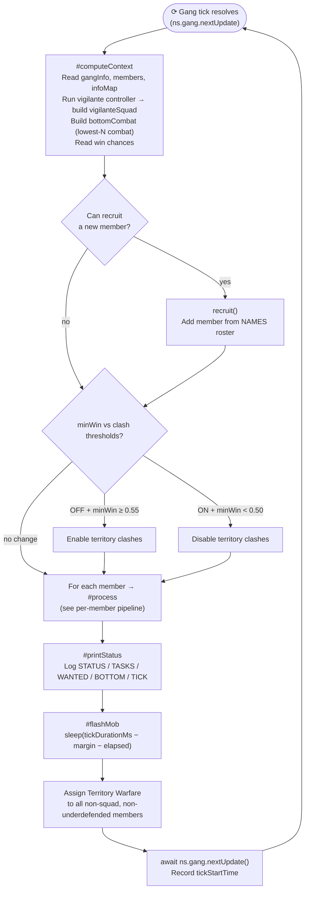
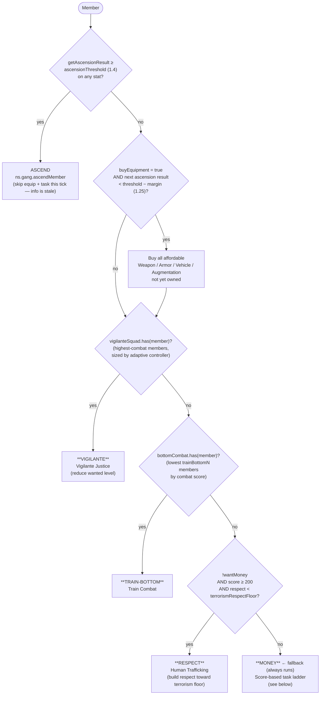
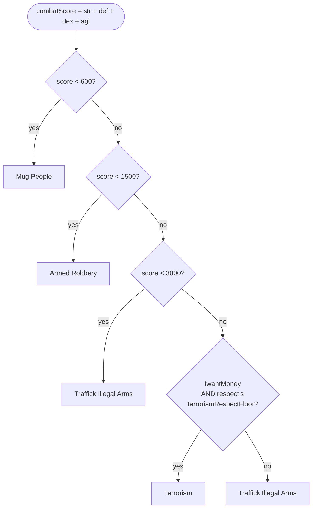
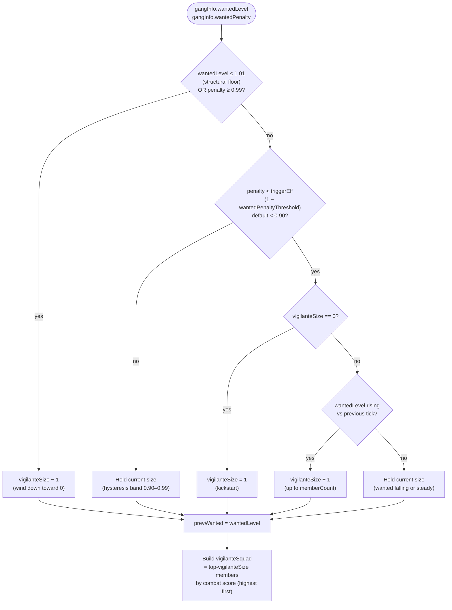

# CombatGangEngine — State Machine

Gang-tick-synced engine. Each cycle consists of a **processing phase** (compute → recruit → clashes → per-member) followed by a **flash-mob phase** (sleep → warfare burst → sync next tick).

---

## Main tick cycle



---

## Per-member pipeline (`#process`)

Runs for every member each tick. Ascension short-circuits the rest.



---

## MONEY task ladder



---

## Vigilante controller (`#updateVigilanteSize`)

Runs every tick inside `#computeContext`. Sizes the suppression squad by feedback — no config needed beyond `gang-wanted-penalty-threshold`.



---

## Flash-mob timing

The flash-mob fires members into Territory Warfare for the final `margin` ms of each gang tick, maximising the territory-gain window without disrupting the steady-state task assignment.

```
Gang tick boundary ────────────────────────────────────────┤
                    │← tickDurationMs − margin − elapsed →│← margin →│
                    [  processing: computeContext + process + status  ][warfare burst][next tick]
                              elapsed                         sleep
```

Members skipped from warfare burst:
- In `vigilanteSquad` (keep suppressing wanted)
- Clashes are ON **and** `def < clashMinDefense` (300) — too weak to survive a clash

---

## State reference

### Per-member task states (priority order)

| Priority | State | Condition | Task assigned |
|---|---|---|---|
| 1 | VIGILANTE | Member in `vigilanteSquad` (adaptive controller) | Vigilante Justice |
| 2 | TRAIN-BOTTOM | Member in `bottomCombat` (lowest `trainBottomN` by score) | Train Combat |
| 3 | RESPECT | `!wantMoney` AND `score ≥ 200` AND `respect < terrorismRespectFloor` | Human Trafficking |
| 4 | MONEY | Always (fallback) | Score ladder → Mug / Armed Robbery / Traffick / Terrorism |

### Global decisions (once per tick)

| Decision | Condition | Action |
|---|---|---|
| Recruit | `canRecruitMember()` | Add next name from NAMES roster |
| Clash ON | Clashes OFF AND `minWin ≥ clashEnableWinChance` | `setTerritoryWarfare(true)` |
| Clash OFF | Clashes ON AND `minWin < clashDisableWinChance` | `setTerritoryWarfare(false)` |
| Ascend | Any `getAscensionResult` stat ≥ `ascensionThreshold` | Ascend member (skips equip+task) |
| Equip | `buyEquipment` AND next asc result `< threshold − margin` | Buy all affordable gear |
| Flash-mob | Every tick, end of cycle | Territory Warfare burst for non-squad members |

## Config keys

| Key | Default | Used by |
|---|---|---|
| `gang-respect-threshold` | 2000 (×1000) | `wantMoney` flag — switches goal from respect to money |
| `gang-ascension-threshold` | 1.4 | Ascend trigger + equip stop threshold |
| `gang-ascension-equip-margin` | 0.15 | Stop equipping when next asc result ≥ 1.25 |
| `gang-buy-equipment` | true | Gate on all equipment purchases |
| `gang-wanted-penalty-threshold` | 0.1 | Vigilante controller trigger (penalty < 0.90) |
| `gang-respect-floor-terrorism` | 100 (×1000) | Minimum respect before Terrorism is used |
| `gang-train-bottom-n` | 3 | How many weakest members train instead of earn |
| `gang-clash-enable-winchance` | 0.55 | Min win chance to turn clashes ON |
| `gang-clash-disable-winchance` | 0.50 | Win chance below which clashes turn OFF |
| `gang-clash-min-defense` | 300 | Min DEF to participate in warfare burst |
| `gang-flash-mob-margin-ms` | 250 | Lead time before tick to assign Territory Warfare |
