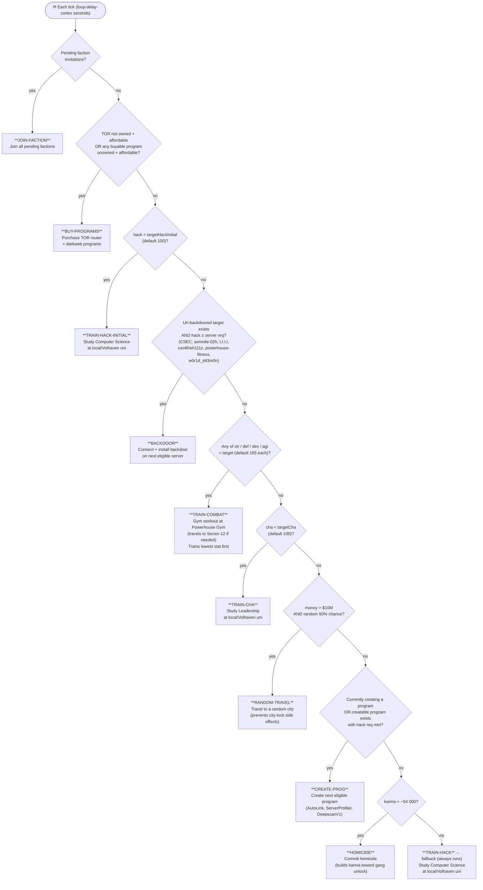

# CortexEngine — State Machine

Each tick the engine walks `STATES_ORDER` top-to-bottom and runs the **first** state whose condition is true. Only one state executes per tick.

## State reference

| Priority | State | Condition | Action |
|---|---|---|---|
| 1 | JOIN-FACTION | Faction invitations pending | Join all factions |
| 2 | BUY-PROGRAMS | TOR affordable OR buyable program affordable | Buy TOR + programs via darkweb |
| 3 | TRAIN-HACK-INITIAL | `hack < targetHackInitial` (100) | Study Computer Science |
| 4 | BACKDOOR | Un-backdoored target reachable at current hack | Install backdoor on target |
| 5 | TRAIN-COMBAT | Any of str/def/dex/agi below target (165 each) | Gym — trains lowest stat first |
| 6 | TRAIN-CHA | `cha < targetCha` (100) | Study Leadership |
| 7 | RANDOM-TRAVEL | money > $10M AND 50% random roll | Travel to a random city |
| 8 | CREATE-PROG | Creatable program exists at current hack level | Create program (AutoLink, ServerProfiler, DeepscanV1) |
| 9 | HOMICIDE | `karma > −54 000` | Commit homicide to build karma |
| 10 | TRAIN-HACK | Always true (fallback) | Study Computer Science |

## Config keys

| Key | Default | Used by |
|---|---|---|
| `cortex-target-hack-initial` | 100 | TRAIN-HACK-INITIAL |
| `cortex-target-combat` | `"165,165,165,165"` | TRAIN-COMBAT (str,def,dex,agi) |
| `cortex-target-cha` | 100 | TRAIN-CHA |
| `loop-delay-cortex` | 10s | Main loop sleep between ticks |
