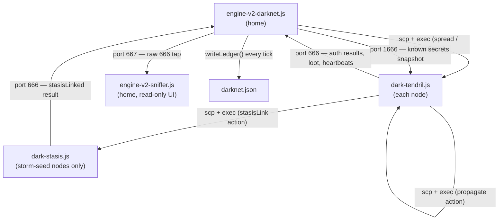

# Darknet Architecture

## Key constraints

- **Port 666** is a drain-queue (consumed by the engine). Port **1666** and **667** are peek-able snapshots (never consumed by readers).
- **dark-stasis.js exists as a separate worker** because `ns.dnet.setStasisLink` costs ~12 GB RAM. Bitburner measures RAM statically from all `ns.*` references in a file — putting it inside the tendril would inflate every tendril's RAM and break propagation on small nodes.
- **darknet.json is wiped on engine start** — it is a persisted projection of the in-memory `nodeMap`, not a warm-start source. The `nodeMap` is always the live source of truth.
- **Secrets are brokered by the engine** — a tendril cracks a node cold and reports the secret on port 666; the engine republishes all known secrets on port 1666 every tick so other tendrils can authenticate without re-cracking.
