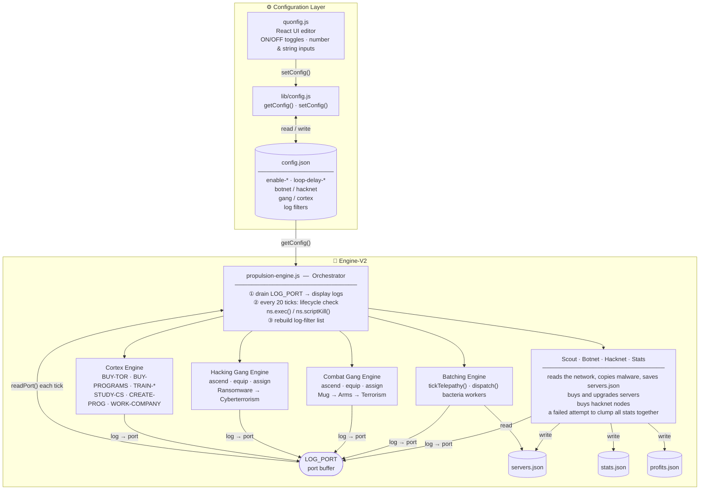

# Engine-V2 Architecture

```mermaid
graph TD

    subgraph CFG ["⚙ Configuration Layer"]
        CJ[("config.json<br/>──────────────────<br/>enable-* · loop-delay-*<br/>botnet / hacknet<br/>gang / cortex<br/>log filters")]
        QF["quonfig.js<br/>React UI editor<br/>ON/OFF toggles · number & string inputs"]
        LC["lib/config.js<br/>getConfig() · setConfig()"]
        QF -->|"setConfig()"| LC
        LC <-->|"read / write"| CJ
    end

    subgraph ENGINES ["🚀 Engine-V2"]
        PE["propulsion-engine.js  —  Orchestrator<br/>─────────────────────────────<br/>① drain LOG_PORT → display logs<br/>② every 20 ticks: lifecycle check<br/>   ns.exec() / ns.scriptKill()<br/>③ rebuild log-filter list"]
        LP(["LOG_PORT<br/>port buffer"])
        LP -->|"readPort() each tick"| PE

        UTIL["Scout · Botnet · Hacknet · Stats<br/>─────────────────────────────<br/>reads the network, copies malware, saves servers.json<br/>buys and upgrades servers<br/>buys hacknet nodes<br/>a failed attempt to clump all stats together"]
        BA["Batching Engine<br/>tickTelepathy() · dispatch() bacteria workers"]
        CG["Combat Gang Engine<br/>ascend · equip · assign<br/>Mug → Arms → Terrorism"]
        HG["Hacking Gang Engine<br/>ascend · equip · assign<br/>Ransomware → Cyberterrorism"]
        CO["Cortex Engine<br/>BUY-TOR · BUY-PROGRAMS · TRAIN-*<br/>STUDY-CS · CREATE-PROG · WORK-COMPANY"]

        SJ[("servers.json")]
        STJ[("stats.json")]
        PJ[("profits.json")]

        UTIL -->|"write"| SJ
        BA -->|"read"| SJ
        UTIL -->|"write"| STJ & PJ
    end

    CJ -->|"getConfig()"| PE
    PE --> UTIL & BA & CG & HG & CO

    UTIL -->|"log → port"| LP
    BA -->|"log → port"| LP
    CG -->|"log → port"| LP
    HG -->|"log → port"| LP
    CO -->|"log → port"| LP
```
